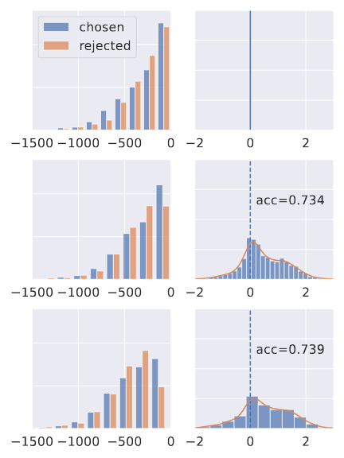

# Introduction

This repository contains the code for our paper [DPO-Shift: Shifting the Distribution of Direct Preference Optimization](https://arxiv.org/abs/2502.07599). We propose a simple method aiming at tackling the widely likelihood displacement phenomenon reported in prior research, where  the probability of chosen responses often decreases during training. Our proposed method strikes a balance between the distribution of the chosen probability and reward margin. The following image provides a brief illsturation for our proposed method. The first row in  represents the SFTed model. The second row corresponds to DPO-Shift, where we observe an increased chosen probability compared to DPO (depicted in the last row). 

</img>

# Training

1. Our code is developed based on the `alignment-handbook`, please install it following `https://github.com/huggingface/alignment-handbook`
2. Add `args.max_steps = max_steps` in the `trainer.py` from `transformer`, this is necessary for the `linear_increase` and `linear_decrease` strategies. This is just a rude solution to track the total numbers of optimization steps, you are welcome to modify it.
3. Run `bash ./run.sh` to start training

# Evaluation

1. Install Fastchat following `https://github.com/lm-sys/FastChat`, then cover the `fastchat` subfile with ours
2. Run MT Bench and generate answer from Model 
 ```Shell
cd Fastchat/fastchat/llm_judge
bench_list=(mt_bench ultrafeedback capybara)
bench_choice=0
folder_path = YOUR_MODEL_PATH

model_id = YOUR_MODEL_ID

python ./gen_model_answer.py \
        --model-path $folder_path \
        --model-id $model_id \
        --bench-name ${bench_list[$bench_choice]} \
        --num-gpus-total number_of_your_gpu \
        > gen_answer_print_log.log 2>&1

```
3. Or you can list all the model you need to evaluate in the `latest_po_info.txt` (do follow the format) and run
 ```Shell
bash ./mtbench.sh
```
4. test win rate with ollama
set `OLLAMA_BINARY` in `ollama-batch-servers` with your ollama binary path
 ```Shell
 cd ollama-batch
 bash ./ollama-batch-servers numbers_of_your_GPU # start ollama processes
 bash ./run.sh # to generate judges
```
5. The judgment is recorded in the `judges` folder
